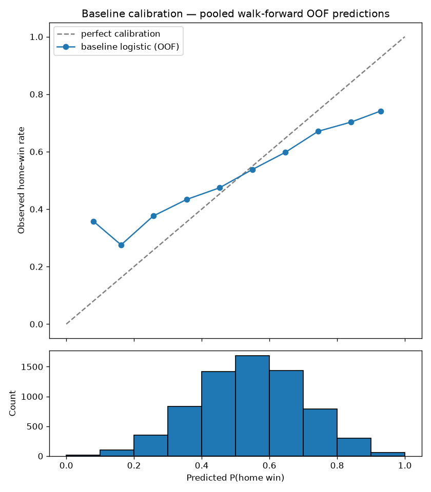

# Phase 2 Results — Feature Store + Baseline Model

**Status: ✅ COMPLETE — success gate PASSED**
**Gate:** walk-forward CV log loss < 0.69 → **achieved 0.6829** (pooled out-of-fold, 6,993 games)
**Date:** July 2026

---

## 1. What was built

| Layer | Table | Rows | Contents |
|---|---|---|---|
| Data (Phase 1, completed here) | `raw.*` | 7,945 games / 683,721 shots / 285,941 skater logs / 31,778 goalie logs | Six full seasons, 2020-21 → 2025-26, all FINAL |
| Features | `features.team_rolling` | 79,450 | 14 rolling stats × 5 windows (5/10/20/40/82) per game × team, strictly prior games only |
| Features | `features.goalie_rolling` | 84,485 | Rolling SV%, GSAx/60, HD-SV%, fenwick SV%, xGA/60 + Buhlmann-shrunk ratings (k = 66) |
| Features | `features.matchup` | 7,945 | Rest, b2b, travel km, DST-aware tz shift, game numbers, season stage, pre-game Elo, starters |
| Features | `features.game_vector` | 7,945 | 107 ordered home−away differential features + label, fully finite |
| Models | `models.model_registry` | `baseline_logreg v1` | CV metrics + feature-set hash + calibration artifact |

Data fixes made along the way:
- **MoneyPuck team codes**: `L.A/N.J/S.J/T.B` normalized to `LAK/NJD/SJS/TBL` — 12.7% of shots were silently failing the game join and biasing every For/Against share (xGF% averaged .543 before the fix, .502 after; it must average ~.500 by construction).
- Venue seed data (`db/seed_venues.sql`) for 33 franchises including the defunct Arizona Coyotes.
- Only known residual gap: one game (BUF–WSH 2022-03-25) absent from MoneyPuck's file entirely; symmetric masking excludes it from both teams' xG windows.

## 2. Walk-forward CV protocol

- Expanding window over seasons: train on all seasons before N, validate on season N.
- 7-day purge gap before each validation period (defensive; season folds already have the off-season between train and validation). Enforced by test.
- `StandardScaler` fit per fold on training rows only.
- `sklearn.LogisticRegression` (default C, max_iter=2000) on the 107-feature vectors.
- No market features (odds collection starts with the daily pipeline — see §5).

## 3. Results

| Validation season | Train games | Log loss | Naive LL | Accuracy | Brier | AUC |
|---|---|---|---|---|---|---|
| 2021-22 | 952 | 0.7067 | 0.6899 | 0.597 | 0.2500 | 0.613 |
| 2022-23 | 2,353 | 0.6802 | 0.6930 | 0.584 | 0.2426 | 0.624 |
| 2023-24 | 3,753 | **0.6646** | 0.6904 | 0.593 | 0.2360 | 0.633 |
| 2024-25 | 5,153 | 0.6683 | 0.6867 | 0.596 | 0.2375 | 0.621 |
| 2025-26 | 6,551 | 0.6948 | 0.6932 | 0.540 | 0.2504 | 0.565 |
| **Pooled OOF** | — | **0.6829** | — | **0.582** | **0.2433** | **0.611** |

Pooled ECE (10 bins): **0.0506**.

The learning curve is the headline: trained only on the 952-game COVID season the model *loses* to the naive base rate; with 2+ seasons it beats naive decisively. Accuracy ~58–59% is exactly where public NHL models without market features sit (ceiling ~62%) — a much better number here would have suggested leakage, not brilliance.



## 4. Caveats & follow-ups for Phase 3

1. **Overconfidence**: the reliability curve has slope < 1 (tails too extreme). Raw logistic regression does this; isotonic calibration (Phase 3) is the fix. Target ECE < 0.02.
2. **2025-26 regression**: fold 5 drops to roughly naive (AUC .565 vs ~.62 elsewhere). Investigate: genuine league drift vs data-quality quirk in the newest season.
3. **Buhlmann k is noisy across seasons** (38–94, pooled 66): revisit once more seasons accumulate; consider estimating on pooled multi-season data directly.
4. **No market features yet** — see below.

## 5. Deferred: market features

`features.game_vector` was designed to carry the opening-line no-vig implied
probability, but `raw.odds_snapshots` is empty for the whole backfill window —
The Odds API integration exists (`ingestion/odds_api.py`) but snapshots only
start accumulating once the daily pipeline runs live. The feature is
documented as deferred in `features/build_vectors.py`; add it once real
snapshots exist. Historical odds backfill options are being evaluated
separately (needed for CLV backtesting in Phase 3).

## 6. Reproduce

```bash
python pipeline.py backfill            # ~2h, idempotent/resumable
python pipeline.py features            # ~1 min, all seasons
python -m models.baseline              # walk-forward CV + plot + registry
pytest tests/ -v                       # 83 tests
```
